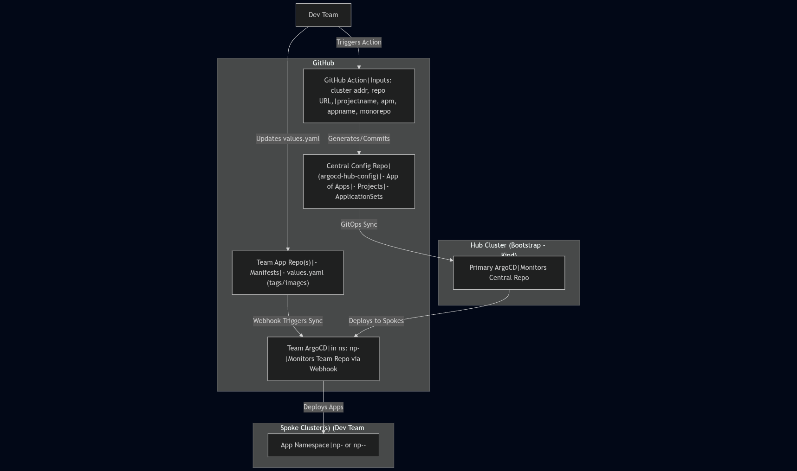
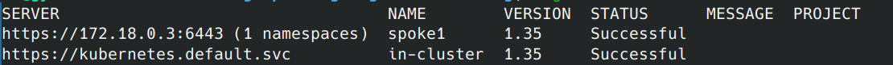
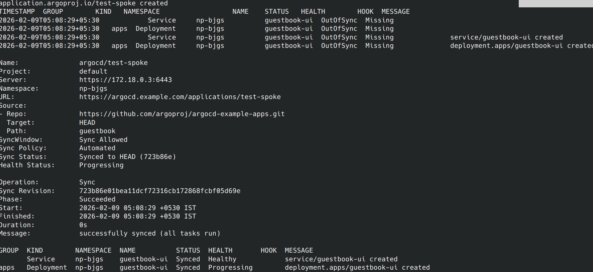

# Infrastructure Design



# Repository Strategy

|Repository|Watched by|Visibility|Purpose|
|--|--|--|--|
|argocd-hub-config|Central configuration (projects, ApplicationSets, spoke ArgoCD installs)|Hub ArgoCD|Private (org)|
|team-app-repo|Application manifests, Helm values, Kustomize overlays|Spoke ArgoCD|Team-controlled|

- Hub: Central control plane.
- Spoke: Isolated per team/cluster, with local ArgoCD managed by hub.
- Flow: Action populates templates in central repo → Hub ArgoCD deploys spoke ArgoCD/projects/ApplicationSets → Team updates their repo → Spoke ArgoCD deploys apps.

# Step-by-Step Setup Instructions

## Step 1: Set Up Local Kind Clusters Install

- Kind (brew install kind on macOS, or see kind.sigs.k8s.io).
- Create hub cluster:

```bash
# Hub cluster (3 nodes + MetalLB)
kind create cluster --name bootstrap --config=kind-hub.yaml
#kind-hub.yaml
kind: Cluster
apiVersion: kind.x-k8s.io/v1alpha4
nodes:
- role: control-plane
- role: worker
- role: worker
networking:
  ipFamily: ipv4
  podSubnet: "10.244.0.0/16"
  serviceSubnet: "10.96.0.0/12"
kubeadmConfigPatches:
- |
  kind: ClusterConfiguration
  networking:
    dnsDomain: cluster.local
    serviceSubnet: 10.96.0.0/12

# Install MetalLB (for LoadBalancer 172.18.255.200)
kubectl apply -f https://raw.githubusercontent.com/metallb/metallb/v0.14.8/config/manifests/metallb-native.yaml

# Example MetalLB config (save as metallb-config.yaml)
cat <<EOF | kubectl apply -f -
apiVersion: metallb.io/v1beta1
kind: IPAddressPool
metadata:
  name: default-pool
  namespace: metallb-system
spec:
  addresses:
  - 172.18.255.100-172.18.255.150
---
apiVersion: metallb.io/v1beta1
kind: L2Advertisement
metadata:
  name: default
  namespace: metallb-system
---
apiVersion: metallb.io/v1beta1
kind: BGPAdvertisement
metadata:
  name: external
  namespace: metallb-system
spec:
  ipAddressPools:
    - default-pool
EOF
```

**kube-proxy Configuration (strictARP)**

MetalLB Layer 2 mode requires strictARP enabled.

```bash
kubectl get configmap kube-proxy -n kube-system -o yaml | \
  sed 's/strictARP: false/strictARP: true/' | \
  kubectl apply -f - -n kube-system
```

Restart kube-proxy:

```bash
kubectl rollout restart daemonset kube-proxy -n kube-system
```

Verify MetalLB speaker pods:

```bash
kubectl get pods -n metallb-system -l component=speaker -o wide
kubectl logs -n metallb-system -l component=speaker
```

## Step 2: Install Hub ArgoCD (Bootstrap)

Use Helm for controlled installs/upgrades.

- Add repo:

``` helm repo add argo https://argoproj.github.io/argo-helm```

- Create values-hub.yaml
(expose UI on LB 172.18.255.100:443, version pinned):

```yaml
# values-hub.yaml - Best practice: Pin version for upgrades
configs:
  params:
    server.insecure: false  # ← change to false (or remove)
server:
  extraArgs:
    - --insecure=false  # optional explicit
  service:
    type: LoadBalancer
    loadBalancerIP: 172.18.255.100
  ingress:
    enabled: false  # still false, since no ingress
  # TLS config (Argo CD will use this secret automatically if named argocd-server-tls)
  # or explicitly:
  # tls:
  #   secretName: argocd-server-tls
```

- Install:

```bash
kubectl create ns argocd
# check latest chart version for argocd
helm search repo argo/argo-cd --versions   |head -3

helm install argocd-hub argo/argo-cd --namespace argocd --values values-hub.yaml --version 9.3.5  # Pin latest stable
# or use upgrade 
helm upgrade argocd-hub argo/argo-cd --namespace argocd --values values-hub.yaml --version 9.3.5
```

- Get initial password:

```bash
kubectl -n argocd get secret argocd-initial-admin-secret -o jsonpath="{.data.password}" | base64 -d
```

- Update admin password and remove initial password

```bash 
argocd login 172.18.255.100 --insecure
argocd account update-password --account admin
```

To restart argoCD deployment:  
```k rollout restart deployment.apps/argocd-hub-server -n argocd```

## Step 3: Create Central Configuration Repository

- Repository name: argocd-hub-config
- Folder structure (best practice: Modular for scalability):

    ```text
    argocd-hub-config/
    ├── apps/  # App of Apps root
    │   └── bootstrap.yaml  # Root Application watching this repo
    ├── projects/  # Per-team AppProjects (generated by Action)
    │   └── np-<apm>.yaml  # e.g., np-team1.yaml
    ├── argocd-installs/  # Spoke ArgoCD installs (Helm-based)
    │   └── np-<apm>/  # Per-team folder
    │       ├── Chart.yaml  # Simple Helm chart for ArgoCD
    │       ├── values.yaml  # Pinned version, webhook config
    │       └── templates/
    │           └── argocd-app.yaml  # Application for spoke ArgoCD
    ├── applicationsets/  # Per-team ApplicationSets
    │   └── np-<apm>.yaml  # Or np-<apm>-<appname>.yaml if not monorepo
    └── .github/workflows/  # Action workflow
        └── self-service.yaml
    ```

```bash
mkdir -p argocd-hub-config/{apps,projects,argocd-installs/np-apmm,applicationsets,.github/workflows}
touch argocd-hub-config/apps/bootstrap.yaml
touch argocd-hub-config/projects/np-apmm.yaml
touch argocd-hub-config/argocd-installs/np-apmm/{Chart.yaml,values.yaml}
mkdir -p argocd-hub-config/argocd-installs/np-apmm/templates
touch argocd-hub-config/argocd-installs/np-apmm/templates/argocd-app.yaml
touch argocd-hub-config/applicationsets/np-apmm.yaml
touch argocd-hub-config/.github/workflows/create-app.yaml
```

- Example bootstrap.yaml (root App of Apps in hub):

```yaml
# bootstrap.yaml - Watches central repo for changes
apiVersion: argoproj.io/v1alpha1
kind: Application
metadata:
  name: root-apps
  namespace: argocd
spec:
  project: default  # Default for hub
  source:
    repoURL: https://github.com/your-org/argocd-hub-config.git
    targetRevision: main
    path: argocd-hub-config/apps  # Or full repo for all
  destination:
    server: https://kubernetes.default.svc  # In-cluster (hub)
    namespace: argocd
  syncPolicy:
    automated:
      prune: true
      selfHeal: true
    
```

- Apply via UI or CLI: 
```argocd app create root-apps --file bootstrap.yaml```


## Step 4: Register Spoke Cluster(s) in Hub ArgoCD


```bash
kind create cluster --name spoke1
```

Please make sure you are switching to correct context when switching between clusters.

- From hub context: Get spoke kubeconfig and create secret.

    ```bash
    kubectl config set current-context kind-spoke1
    kind get kubeconfig --name spoke1 > spoke1.kubeconfig
    ```

  - Find the nodeIP

    ```bash
    docker inspect spoke1-control-plane | grep IPAddress
    "IPAddress": "172.18.0.3",
    ```

  - Edit the spoke1.kubeconfig and update the IP in the line server. Find the server: line (it will be https://spoke1-control-plane:6443).  

  >KIND clusters are Docker containers, so from the hub cluster's pod perspective, you need an IP/port reachable over the Docker network (not localhost). The host's DNS resolver (systemd-resolved on Ubuntu/Debian, listening on 127.0.0.53) cannot resolve spoke1-control-plane because it's a Docker-internal container name — not exposed to the host's DNS

   ```bash
    cat spoke1.kubeconfig  |grep server:
    server: https://172.18.0.5:6443
    ```

    ```bash
        argocd cluster add kind-spoke1 --kubeconfig spoke1.kubeconfig --name spoke1 --namespace np-<apm> --yes  # Restrict to team ns
    ```

    This will create service account , role, rolebinding.

``` text
    argocd cluster add kind-spoke1 \
--kubeconfig spoke1.kubeconfig \
--name spoke1 \
--namespace np-bjgs \
--insecure --yes  # skip prompt if desired

{"level":"info","msg":"ServiceAccount \"argocd-manager\" already exists in namespace \"kube-system\"","time":"2026-02-09T04:47:42+05:30"}
{"level":"info","msg":"Role \"np-bjgs/argocd-manager-role\" updated","time":"2026-02-09T04:47:42+05:30"}
{"level":"info","msg":"RoleBinding \"np-bjgs/argocd-manager-role-binding\" updated","time":"2026-02-09T04:47:42+05:30"}
{"level":"info","msg":"Using existing bearer token secret \"argocd-manager-long-lived-token\" for ServiceAccount \"argocd-manager\"","time":"2026-02-09T04:47:42+05:30"}
Cluster 'https://172.18.0.3:6443' added
```


- Best practice: Label clusters for ApplicationSet selectors (e.g., ```kubectl label clustersecrets spoke1 environment=dev```).

### Verify:
```bash 
# List clusters in Argo CD
argocd cluster list
```

Additionally verify the secret is created in hub cluster context
```bash
kubectl config set current-context kind-bootstrap
kubectl get secret -n argocd -l argocd.argoproj.io/secret-type=cluster ```
```

Note: to re-add a cluster/update secret use Use --upsert flag in argocd command (cleans up old bad secret)

At this point the spoke cluster may have status Unknown.  

#### Why "Unknown" Status?
Primary cause: Argo CD's server (in the hub) periodically queries the spoke cluster's Kubernetes API (/version endpoint) to fetch the version and confirm connectivity. If this query fails or hasn't succeeded yet, the status shows "Unknown" (with an empty VERSION field).

The MESSAGE ("Cluster has no applications and is not being monitored") is expected and harmless—it's just noting no Argo CD Applications are targeting spoke1 yet, so full monitoring hasn't kicked in.

#### Deploy a Test App to Spoke1
Create a simple test Application in hub targeting spoke1.  
File: [test-spoke.yaml](test-spoke.yaml) 





If it deploys (check kubectl --context ```kind-spoke1 get po -n np-bjgs```, great—delete it after: ```argocd app delete test-spoke --yes``` as this was just used to test the connectivity from hub to spoke.

#### Troubelshooting:
In case if the argoCD spoke cluster is showing credential related error, there is a possiblity the insecure flag is not set.  
Patch the secret  

```bash
SECRET_NAME=cluster-172.18.0.5-2798883321

kubectl patch secret $SECRET_NAME -n argocd --type='json' -p='[
  {"op": "add", "path": "/data/config", "value": "'$(kubectl get secret $SECRET_NAME -n argocd -o jsonpath='{.data.config}' | base64 -d | jq '. + {"tlsClientConfig": {"insecure": true}}' | base64 )'"}
]'
# verify
kubectl get secret  cluster-172.18.0.5-2798883321 -o jsonpath='{.data.config}' | base64 -d

  {
    "tlsClientConfig": {
    "insecure": true
    }
  }

# Restart controller
kubectl rollout restart deployment argocd-application-controller -n argocd

```


## Step 5: Configure Central Config Repo (root-app):
File: bootstrap.yaml -  it's the root App in hub watching the repo.
From hub context:  

```bash
kubectl config set current-context kind-bootstrap
argocd app create root-apps --file argocd-hub-config/apps/bootstrap.yaml --upsert
argocd app sync root-apps
```

File: [projects/np-bjgs.yaml](argocd-hub-config/projects/np-bjgs.yaml) : AppProject for your team  
File: [argocd-installs/np-bjgs/Chart.yaml](argocd-hub-config/argocd-installs/np-bjgs/Chart.yaml)  
File: [argocd-installs/np-bjgs/values.yaml](argocd-hub-config/argocd-installs/np-bjgs/values.yaml) :customize spoke Argo CD: no ingress/LB, insecure for local  
File: [argocd-installs/np-bjgs/templates/argocd-app.yaml](argocd-hub-config/argocd-installs/np-bjgs/templates/argocd-app.yaml): Application from hub deploying spoke Argo CD via Helm.  
File: [applicationsets/hub-config.yaml](argocd-hub-config/applicationsets/hub-config.yaml): ApplicationSet for team apps; generators pull from team repo branches/tags  

Commit/push to GitHub, then sync root-apps in hub UI/CLI


## Step 6: Configure Webhooks in Team Repos

- In team repo (e.g., for app manifests/values.yaml):
  - Go to Settings > Webhooks > Add webhook.
  - Payload URL: Spoke ArgoCD API.  
  e.g. https://argocd.np-<apm>.example.com/api/webhook
  - Content type: application/json
  - Secret: Generate in ArgoCD UI (Settings > Webhooks), store securely.
  - Events: Push events (for tag/value changes).
- In spoke ArgoCD values.yaml: Enable webhook receiver.

Since the cluster is running locally, you can use smee.io to expose a public endpoint for your cluster using the smee client.  

## Step 6: Trigger End-to-End Deployment

- Usage Flow (Dev Team Perspective)
  1. Team member goes to argocd-hub-config repo → Actions → "Self-Service – Create Team ArgoCD Setup"
  2. Fills in form (cluster address, their repo URL, apm code, etc.)
  3. Workflow runs → commits new files to main
  4. Hub ArgoCD detects change → deploys:
      - AppProject
      - Spoke ArgoCD instance (in namespace np-<apm>)
      - ApplicationSet(s)
  5. Team updates image tag / Helm values in their own repo
  6. GitHub webhook → Spoke ArgoCD syncs → application deploys

## Step 7: Upgrades and Monitoring

- Upgrade ArgoCD: Update Helm version in values.yaml → Git commit → Sync.
- Monitor: Use ArgoCD UI in hub for overview; spoke UIs for team-specific.
- Security: Audit RBAC regularly; use ArgoCD's disaster recovery best practices (backup configs).

## Step 8: Set Up GitHub Action for Self-Service

File: [Self-Service-Create](.github/workflows/self-service-create.yaml) 

- Add repo secrets: GITHUB_TOKEN (auto-generated or PAT for pushes).

### Appending Source Repos via GitOps (Platform Team Responsibility)

File: [Workflow](.github/workflows/append-source-repo.yaml)

### GitHub Issue Template

File:[Append-Repo](.github/ISSUE_TEMPLATE/append-source-repo-request.md)

### Next steps:

- Add Sealed Secrets or External Secrets Operator
- Implement promotion pipelines (dev → staging → prod)
- Add policy enforcement (Kyverno / OPA Gatekeeper)
- Set up ArgoCD Image Updater
- Multi-source Applications (Helm + Kustomize)
